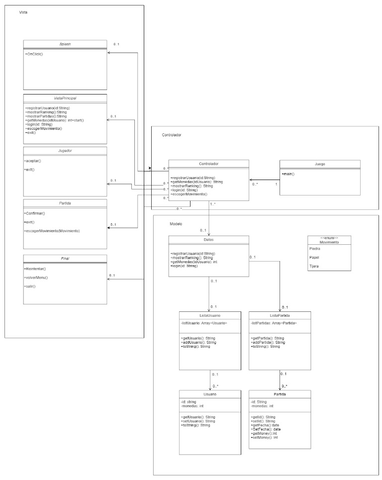

# NativeNinjas 🉐 - Piedra Papel Tijera 
Rock, Paper, Scissors app featuring random selection for gameplay against the computer, implemented with DAO and MVC architecture, and utilizing SQLite for safe storage of player rankings

## 🗡️Technologies Used 
- Language: Java
- Data Persistence: SQLite (In-memory game state)
- Design Pattern: MVC (Model-View-Controller)

## 🗡️ Functional Requirements
- Detailed mockup serves as a visual guide for UI design.
- Intuitive and attractive UI implemented based on the designed mockup.
- User always begins a new game with three attempts.
- User can choose between rock, paper, or scissors.
- Application generates a random move.
- Determines the winner and displays it to the user.
- Allows user to restart the game at any time.
- Displays the total coins the user has during the game.
- User can access the history, showing results of all games (names, coins, ranking, and date).
- Shows the current coin record.
- Utilizes SQLite database for storing game history and player's coin amount.
- Utilizes asynchronous capabilities of RxJava to enhance performance of SQLite database read/write operations.

## 🗡️ Non-functional Requirements
- Application must be user-friendly.
- Application must have an attractive UI.
- Application must be resource-efficient.
- Application must be compatible with different Android devices.

## 🗡️ UML Sequence Diagram 

## 🗡️ UML Class Diagram

## 🗡️ Mockup UI

## 🗡️ Use of Constraints for Adaptive Design
In our project, we found that using constraints in Constraint Layout is essential for creating interfaces adaptable to different screen sizes and device orientations. By defining vertical and horizontal constraints properly, aligning views correctly, and adjusting margins and relative dimensions, we achieved a consistent and visually appealing design across a variety of devices.

## 🗡️ Asynchronous SQLite Calls with RxJava
In the provided example, we used RxJava along with the Single class to perform an asynchronous query to the SQLite database to obtain the player's ranking. The `getRanking()` function returns a Single that emits a list of players ordered by score asynchronously.

This approach ensures that database query operations are performed efficiently and without affecting the responsiveness of the UI.

## 🗡️ Data Storage and Management

- Utilization of Static Resources: Static resources have been used to store game images, improving application efficiency and loading.
- SQLite Database: The application utilizes an SQLite database to store game history and player's coin amount efficiently and securely.
- Retrieving Scores: Scores stored in the SQLite database are retrieved to display the highest scores on the application's home screen.