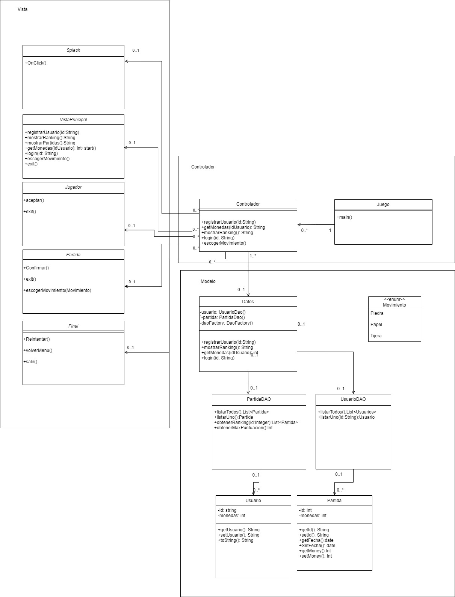

# NativeNinjas 🉐 - Piedra Papel Tijera 
Rock, Paper, Scissors app featuring random selection for gameplay against the computer, implemented with DAO and MVC architecture, and utilizing SQLite for safe storage of player rankings

## Video Presentation of the Finished Product
Watch the video presentation [here](https://youtu.be/ewxQMzPjMV4).

## 🗡️Releases 
The app has three versions available, which can be accessed through the [Releases](https://github.com/Jve386/NativeNinjas-Apps/releases) page: Product 1, Product 2, and Product 3.

## 🗡️Technologies Used 
- Language: Java, Kotlin
- Data Persistence: SQLite (In-memory game state)
- Design Pattern: MVC (Model-View-Controller)
- Network Calls: Retrofit
- JSON Parsing: Moshi/Gson
- Backend: Firebase
- Authentication: Google Sign-In
- Maps: Google Maps API
- Concurrency: RxJava

## 🗡️ Functional Requirements
- Detailed mockup serves as a visual guide for UI design.
- Intuitive and attractive UI implemented based on the designed mockup.
- User always begins a new game with three attempts.
- User can choose between rock, paper, or scissors.
- Application generates a random move.
- Determines the winner and displays it to the user.
- Allows user to restart the game at any time.
- Displays the total coins the user has during the game.
- User can access the history, showing results of all games (names, coins, ranking, and date).
- Shows the current coin record.
- Utilizes SQLite database for storing game history and player's coin amount.
- Utilizes asynchronous capabilities of RxJava to enhance performance of SQLite database read/write operations.

## 🗡️ Non-functional Requirements
- Application must be user-friendly.
- Application must have an attractive UI.
- Application must be resource-efficient.
- Application must be compatible with different Android devices.

## 🗡️ UML Sequence Diagram 

## 🗡️ UML Class Diagrams

## 🗡️ Mockup UI

## 🗡️ Use of Constraints for Adaptive Design
In our project, we found that using constraints in Constraint Layout is essential for creating interfaces adaptable to different screen sizes and device orientations. By defining vertical and horizontal constraints properly, aligning views correctly, and adjusting margins and relative dimensions, we achieved a consistent and visually appealing design across a variety of devices.

## 🗡️ Asynchronous SQLite Calls with RxJava
In the provided example, we used RxJava along with the Single class to perform an asynchronous query to the SQLite database to obtain the player's ranking. The `getRanking()` function returns a Single that emits a list of players ordered by score asynchronously.

This approach ensures that database query operations are performed efficiently and without affecting the responsiveness of the UI.

## 🗡️ Data Storage and Management

- Utilization of Static Resources: Static resources have been used to store game images, improving application efficiency and loading.
- SQLite Database: The application utilizes an SQLite database to store game history and player's coin amount efficiently and securely.
- Retrieving Scores: Scores stored in the SQLite database are retrieved to display the highest scores on the application's home screen.

## 🗡️ Features added for [Product 2](https://github.com/Jve386/NativeNinjas-Apps/releases/tag/Producto2)
- Background Music: Implemented background music with the ability to toggle it on or off. Users can select background music from device media resources or use the official game melody.
- Multimedia Best Practices: Implemented proper multimedia programming practices, including handling events such as incoming calls or alarm sounds.
- Animations and Sounds: Applied animations and sounds to the movements of game pieces.
- Gallery Access: Enabled access to the device's image gallery to store screenshots of victories.
- Victory Storage in Calendar: Stored victories in the device's calendar, noting the date and time of each victory.
- Help Section with WebView: Added a help section accessible through a WebView, providing information about the game.
- Location Storage: Optimally retrieved and stored player location in the database.
- Notification on Victory: Displayed a basic notification upon winning, featuring the app's icon, and showing the resolution time upon tapping.
- Multilingual Support: Automatically detects and uses the player's device language, with manual language selection available within the app.
- Concurrent Programming: Implemented concurrent programming techniques using Android services to enhance application responsiveness and performance.

## 🗡️ Features added for [Product 3](https://github.com/Jve386/NativeNinjas-Apps/releases/tag/Producto3)
- Random Phrases at App Start: Utilizes JSON and Retrofit for random phrases displayed at the start, implemented with Kotlin and coroutines.
- External Libraries: Integrated Moshi/Gson and Retrofit for improved app performance, including a Retrofit call to Firebase through REST.
- Firebase Database: Implemented Firebase for data storage, including player authentication via Google Sign-In.
- Player Communication: Backend storage and retrieval of top ten scores, along with a common prize for players.
- Google Maps API: Added to locate players, storing their locations in Firebase.
- Rewards Screen: Allows players to redeem points for items stored in Firebase.
